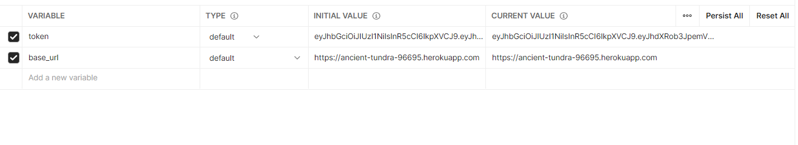
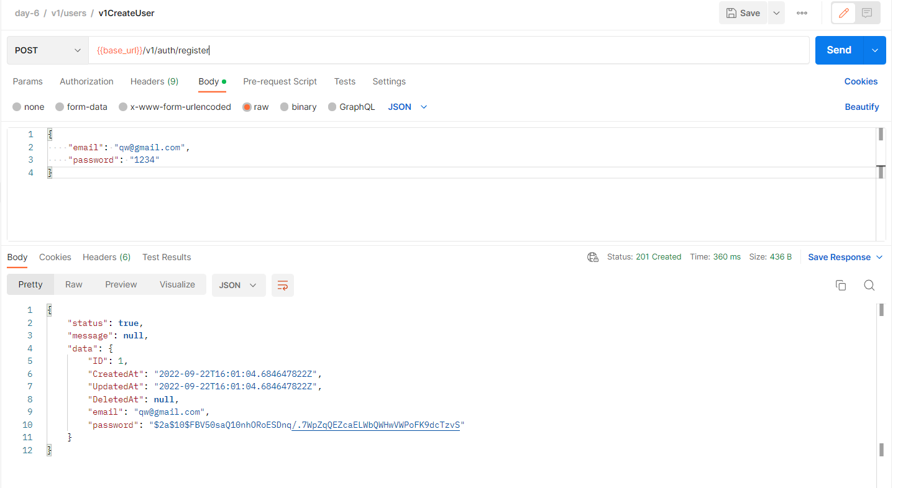
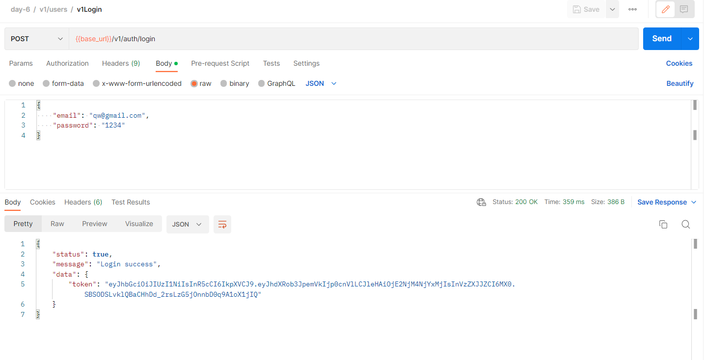
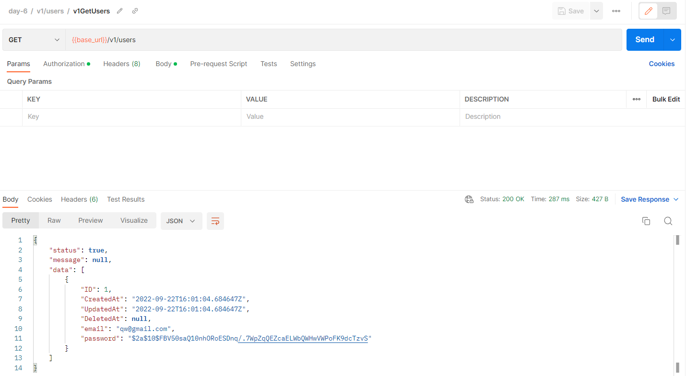
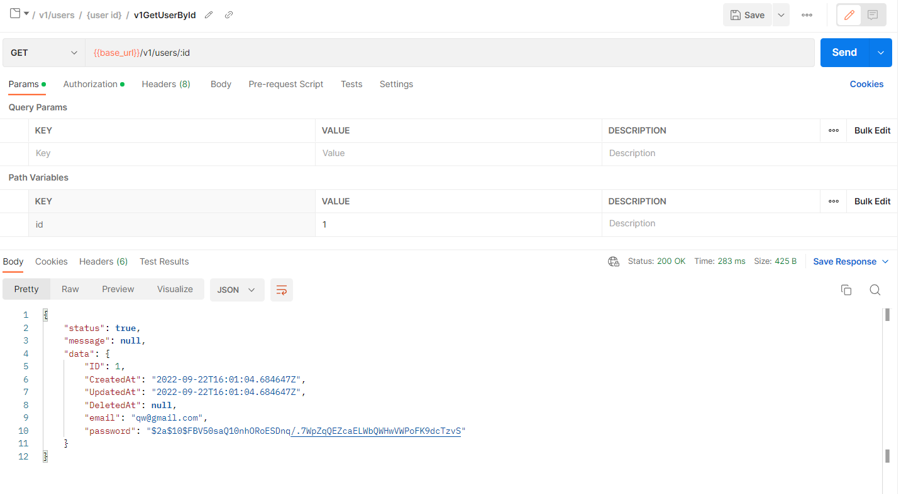
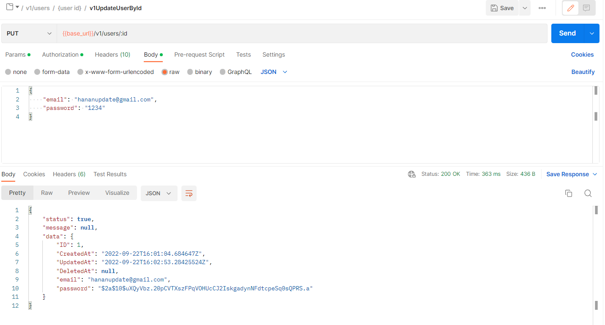
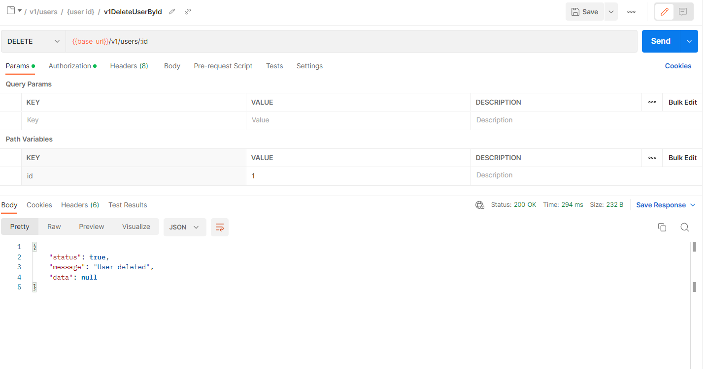
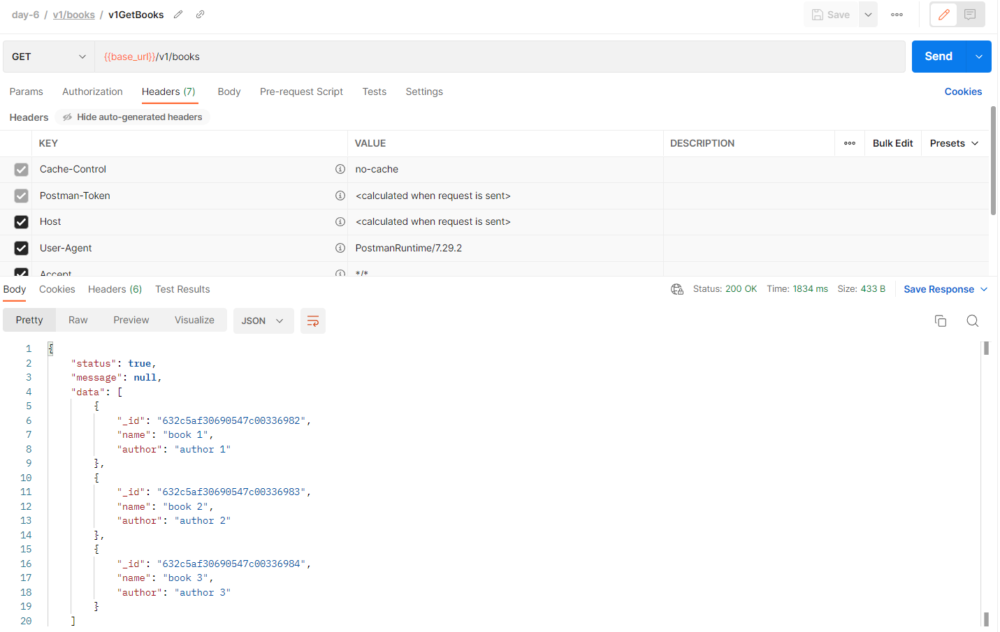

# docker image url
```
https://hub.docker.com/r/oktav1722/agmc-day-7
```

# run on terminal
## pull image
```
docker pull oktav1722/agmc-day-7:latest
```
## run docker
```
docker run -d -p 8080:8080 -e APP_ENV=production -e DB_USER=postgres -e DB_PASS=11111111 -e DB_HOST=host.docker.internal -e DB_NAME=agmc-day2 -e DB_PORT=5432 -e MONGO_URI=mongo.uri -e MONGO_DBNAME=alterra-agmc oktav1722/agmc-day-7
```

# postman test

## enviroment


## api
* register

* login

* get users

* get user by id

* update

* delete

* get books



